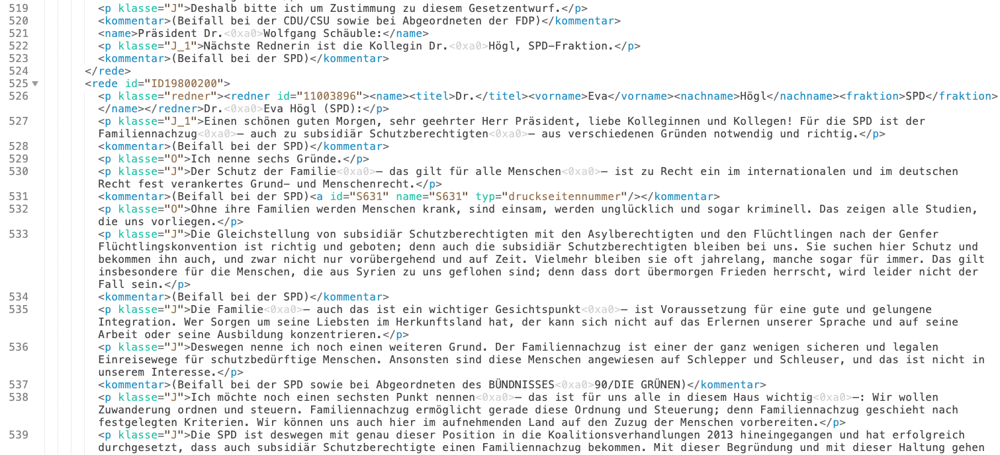
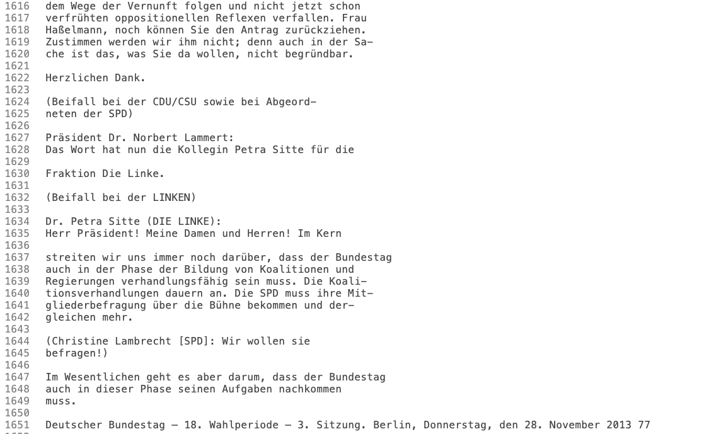
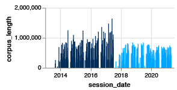

# The big challenges of the Merkel era: How the German parliament discussed internationally relevant issues

Idea: [Peter Hille](https://twitter.com/peterhille) & [Gianna Grün](https://twitter.com/giannagruen)

Data analysis and visualization: [Gianna Grün](https://twitter.com/giannagruen)

Writing: [Peter Hille](https://twitter.com/peterhille) & [Gianna Grün](https://twitter.com/giannagruen)

You can read the story in [English](https://www.dw.com/en/how-german-parliament-debated-the-big-crises-of-the-merkel-era/a-59201297) and [German](https://www.dw.com/de/die-gro%C3%9Fen-krisen-der-merkel-%C3%A4ra/a-59188829).

# Data Source

The data source for this project is the [German Parliament](https://www.bundestag.de/services/opendata), more specifically the protocols from parliamentary sessions from 2005 to 2021 - covering all four terms of Angela Merkel's chancellorship.

## 19th term data
The protocols for the 19th parliamentary term (2017-2021) were available in a machine-readable xml-file [see documentation here](https://www.bundestag.de/resource/blob/577234/f9159cee3e045cbc37dcd6de6322fcdd/dbtplenarprotokoll_kommentiert-data.pdf) and scraped by [Kira Schacht](https://twitter.com/daten_drang) for another project comparing chancellor candidates ([story](https://p.dw.com/p/3wST7) and [code](https://github.com/dw-data/candidates)).

There are two main advantages for the 19th term data:

- within each protocol, actual speaking contributions by parliamentary members are easily distinguishable from other document contents like attachments and supporting information

- it's easy to attribute each speaking contribution to a speaker, who also already come with a party attribution

The protocol-xmls were then converted to a dataframe where each protocol is a row, and individual columns for session date, protocol number (for reference), and protocol text.

## 16th to 18th term data

Although the protocols of the 16th to 19th parliamentary term are *saved* in an xml file format, they are largely not formatted as an xml file. They contain a basic `head` (10 lines), but the rest is formatted as pure text.

Thus, the two main advantages of the 19th term data don't hold true here: in the raw data, it's very difficult for a computer algorithm to access speaking contrubtions only and attribute them to the adequate speaker.

### Data Processing

To make the protocols of the 16th to 18th term accessible for data analysis, we implemented some processing steps to format the older protocols in a similar way like the newer ones, meaning breaking down the long text block into individual speaking contributions and documenting who said what.

The text was reformatted with a series of Regular Expressions, given that speaker introductions were formatted similarly in the text blocks: `FirstName LastName (Party):` 

The result was a dataframe with the same structure as the 19th term data has (see above).

After that, several data cleaning steps were implemented to get rid of line breaks within words and to unify spellings of party affiliations for example.

As a final step, both dataframes - one containing the 19th term protocol and the other containing the 16th to 18th term protocols - were concatenated and used for data analysis.

### Caveats

We checked whether corpus length was roughly similar between sessions, comparing the "old" file-format (dark blue) with the "new" file-format (ligth blue). While the corpus length looks shorter visually for 19th term sessions, the median corpus length is actually longer (median of 408K characters per session) than for 18th term sessions (median of 356K characters per session).

The fact that older protocols appear shorter in character length is somewhat expectable, given that with regular expressions, we can only account for patterns we identified, but there's but there is a chance there were text formatting patterns we missed. Furthermore we noticed that three protocols could not be processed.

Given that we look at broad trends rather than fine-tuned comparisons between terms or terms over time, we deemed the dataset robust enough for further analysis. 

Overall, these caveats lead to reported numbers being conservative figures, meaning the actual numbers might be even higher than the ones reported if all data was accessible in a machine-readable way.

# Analysis steps

## Selection of topics - proof of concept

We started out with a proof of concept, manually searching for specific terms like climate change, refugees, financial crisis, covid. Once we saw significant differences both in occurrences as well as development over time for all terms, we decided to proceed with this project and refine the analysis.

## Creating a word list

While searching for specific terms was a good first indication, it comes with the drawback that you only find what you are searching for. 

To address and circumvent this, we implemented a **count vectorizer** that would identify every word in the corpus as well as its occurrence.

To get rid of **stop words**, like "that's why" or "because", we used [this list]() to filter out meaningless words before implementing the count vectorizer again.

Lastly, we added a **stemmer** to our count vectorizer, to reduce words to their word stems and counting xyz as one word instead of as three.

We introduced a cut at a minimum of 5 occurrences in the overall corpus, which reflects the threshold for the third quartile (75% of identified word stems had less than 5 occurrences).

This led to a list of ~ 90,000 word stems plus their occurrences. 

### Caveats 

Scanning through this list of word stems, we realized that the stemmer wasn't as good as we hoped for German, cutting words at special characters like `ü`, `ä`, `ö`, `ß` - despite the stemmer's documentation outlining that it should be able to transform it to their equivalents `ue`, `ae`, `oe`, `ss`. 

Additionally we noticed that some inconsistencies - ie identical stems listed twice in the word stem list, pointing at additional reasons the computer algorithm perceiving them as individual rather than identical words (like different character encodings).

This made us decide against implementing a [Term-frequency inverse-document frequency (td-idf)](https://investigate.ai/text-analysis/a-simple-explanation-of-tf-idf/) vectorizer, but opt for manual checking of words instead.

## Identification of "topic" words & editorial choices

We made the editorial choice to only include word stems with at least 100 mentions in our analysis, reducing the list of potential topic words from 90,000 to around 16,500 word stems.

These word stems with at least 100 mentions were then manually labelled and double-checked by an additional person. 

A word was labelled a topic if it related to a domestic policy (eg. pensions) or foreign policy field (eg. development aid) or to societal values (eg. equality). 

We ignored all offices and names of people, self-referencing words like "domestically", or words that are used ubiquitiously ("global", "national"), as figurative speech ("fight"), as well as everything that could not be assigned unambiguously to one topic (eg. "pollutant" - could relate to climate, chemical industry, environment, agriculture).

## Clustering of topic words

The above outlined labelling yielded almost 1,500 topic words. These were subsequently clustered.

### Broad cluster: domestic/foreign policy, values

Each topic word was assigned an area: foreign policy, domestic policy or other (for all societal values or those at the intersection between values and domestic policy). 

~ 800 topic words were assigned to the foreign policy theatre
~ 500 topic words were assigned to the domestic policy theatre
~ 140 topic words were assigned the "other" class

### Detailed clusters: climate, migration, finance, foreign relations

Next, only the topic words from the foreign policy theatre were grouped into more granular topic clusters. The resulting overview can be found [here](data/TopicWords-Clustered.csv).

For the first chart we created an overall ranking of topic clusters, counting all-time mentions.

For each of the topic cluster, we produced an additional chart, showing the development of particular topics over time.

For this, we first calculated the term frequency per 100,000 words (mentions of a topic per session / all words per session * 100000); however, we noticed in a second step that the absolute mentions (mentions of a topic per session) does not lead to a significantly different picture, which is why we opted to use this representation in the article rather than the relative term frequency, given that it is both easier to communicate as well as to understand.

**Note:** For the charts over time, we made the choice not to plot all topics within one cluster, but only selected ones of interest. Furthermore, we accumulated mentions of several terms behind each label: "climate change" does not only track the mentions of climate change, but also synonyms like "climate crisis" for example, whereas for "Turkey" we'd also count "Ankara" and "Erdogan". You can find a list which topics were aggregated under which label [here](data/TopicCluster-Labels.csv).

# Questions and feedback

If you have any questions and remarks or noticed an error in our analysis, please don't hesitate to reach out at data-team[at]dw.com